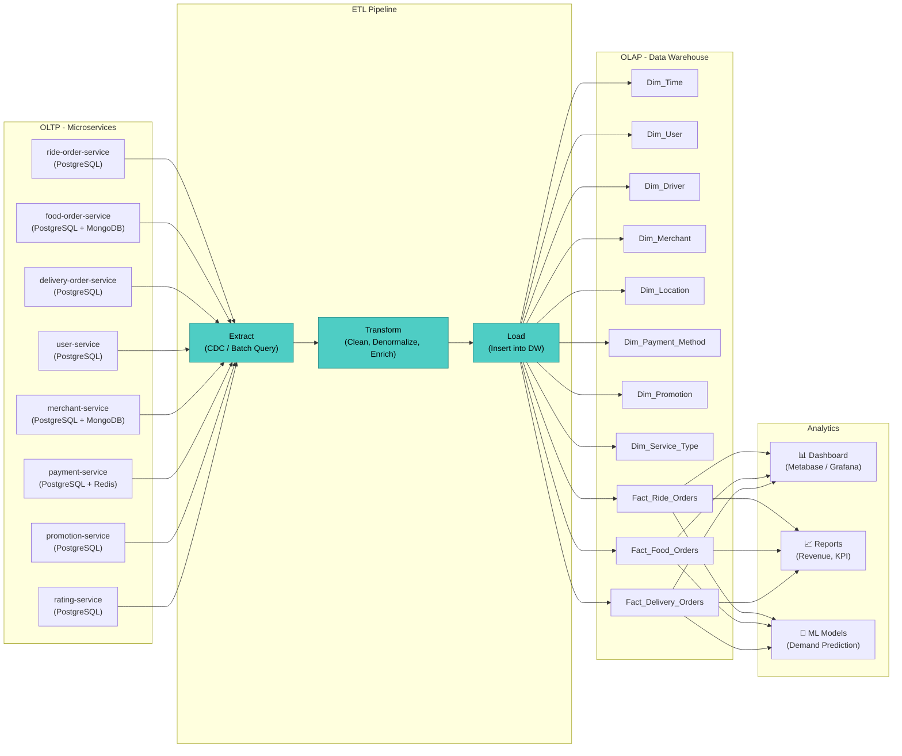

# Rancangan Data Warehouse — Clay Platform

> **Perspektif:** Seorang *Manager Operations* Clay (seperti Manager Gojek) yang ingin menganalisis performa layanan, driver, merchant, dan revenue.

---

## 1. Pemilihan Skema: Fact Constellation (Galaxy Schema)

Clay adalah **superapp** dengan 3 layanan inti (Ride, Food, Delivery). Masing-masing punya karakteristik yang berbeda, sehingga kita butuh **lebih dari satu Fact Table** yang saling berbagi dimensi. Ini disebut **Fact Constellation** atau **Galaxy Schema**.

### Kenapa Fact Constellation, bukan Star Schema biasa?

| Pertimbangan | Penjelasan |
|---|---|
| Multi-service | Clay punya Ride, Food, dan Delivery — masing-masing perlu Fact Table sendiri karena measures-nya berbeda |
| Shared Dimensions | User, Driver, Time, Location, Payment dipakai oleh semua service → efisien jika dishare |
| Analisis cross-service | Manager bisa query: "Total revenue per kota dari semua layanan" tanpa JOIN yang rumit |

---

## 2. Identifikasi Dimensi (GROUP BY apa aja?)

> 💡 **Dimensi = kolom yang dipakai untuk GROUP BY saat analisis**

Bayangkan kamu Manager Clay, kamu pasti mau lihat data berdasarkan:

| Dimensi | Contoh Pertanyaan Manager |
|---|---|
| **Waktu** | "Revenue bulan ini vs bulan lalu?" |
| **User** | "Siapa top 10 customer?" |
| **Driver** | "Driver mana yang paling produktif?" |
| **Merchant** | "Merchant mana yang paling banyak order?" |
| **Lokasi** | "Kota mana yang paling ramai?" |
| **Payment** | "Berapa persen pakai GoPay vs Cash?" |
| **Promo** | "Promo mana yang paling efektif?" |
| **Service Type** | "Perbandingan Ride vs Food vs Delivery?" |

---

## 3. Diagram ER — Fact Constellation

### 3.1. Overview: Galaxy Schema Clay

```mermaid
graph TB
    subgraph "📊 FACT TABLES"
        F1["🚗 Fact_Ride_Orders"]
        F2["🍔 Fact_Food_Orders"]
        F3["📦 Fact_Delivery_Orders"]
    end

    subgraph "📐 DIMENSION TABLES"
        D1["⏰ Dim_Time"]
        D2["👤 Dim_User"]
        D3["🏍️ Dim_Driver"]
        D4["🏪 Dim_Merchant"]
        D5["📍 Dim_Location"]
        D6["💳 Dim_Payment_Method"]
        D7["🎫 Dim_Promotion"]
        D8["🔧 Dim_Service_Type"]
    end

    D1 --> F1
    D1 --> F2
    D1 --> F3

    D2 --> F1
    D2 --> F2
    D2 --> F3

    D3 --> F1
    D3 --> F2
    D3 --> F3

    D5 --> F1
    D5 --> F2
    D5 --> F3

    D6 --> F1
    D6 --> F2
    D6 --> F3

    D7 --> F1
    D7 --> F2
    D7 --> F3

    D8 --> F1
    D8 --> F2
    D8 --> F3

    D4 --> F2

    style F1 fill:#FF6B6B,stroke:#CC0000,color:#fff
    style F2 fill:#FFA94D,stroke:#CC7700,color:#fff
    style F3 fill:#51CF66,stroke:#2B8A3E,color:#fff
    style D1 fill:#74C0FC,stroke:#1C7ED6,color:#000
    style D2 fill:#B197FC,stroke:#7048E8,color:#000
    style D3 fill:#FFD43B,stroke:#F59F00,color:#000
    style D4 fill:#F783AC,stroke:#C2255C,color:#000
    style D5 fill:#63E6BE,stroke:#0CA678,color:#000
    style D6 fill:#A9E34B,stroke:#66A80F,color:#000
    style D7 fill:#FF922B,stroke:#E8590C,color:#000
    style D8 fill:#CED4DA,stroke:#868E96,color:#000
```



### 3.2. Detail Tabel: Dimension Tables

```mermaid
erDiagram
    Dim_Time {
        int time_key PK "Surrogate Key"
        date full_date "2026-05-21"
        int day "21"
        string day_of_week "Wednesday"
        int week "21"
        int month "5"
        string month_name "May"
        int quarter "2"
        int year "2026"
        int hour "14"
        string time_period "Afternoon"
        boolean is_weekend "false"
        boolean is_holiday "false"
        string peak_category "peak / off-peak"
    }

    Dim_User {
        string user_key PK "Surrogate Key"
        string user_id "dari user-service"
        string full_name "Muhammad Azmi"
        string phone_number "+62812xxxx"
        string email "user@email.com"
        string city "Jakarta"
        string registration_date "2025-01-15"
        string user_segment "regular / premium / new"
        int total_lifetime_orders "47"
    }

    Dim_Driver {
        string driver_key PK "Surrogate Key"
        string driver_id "dari user-service"
        string full_name "Budi Santoso"
        string phone_number "+62813xxxx"
        string vehicle_type "motor / car"
        string status "active / inactive / suspended"
        string city "Jakarta"
        date joined_date "2025-03-01"
        float avg_rating "4.8"
        int total_trips "1200"
    }

    Dim_Merchant {
        string merchant_key PK "Surrogate Key"
        string merchant_id "dari merchant-service"
        string merchant_name "Warung Nasi Padang"
        string category "food / beverage / grocery"
        string city "Jakarta"
        string status "active / closed / suspended"
        float avg_rating "4.5"
        int total_reviews "320"
        int min_order_cents "15000"
    }

    Dim_Location {
        string location_key PK "Surrogate Key"
        string city "Jakarta"
        string district "Kebayoran Baru"
        string province "DKI Jakarta"
        string country "Indonesia"
        float latitude "-6.2088"
        float longitude "106.8456"
        string zone_category "urban / suburban / rural"
    }

    Dim_Payment_Method {
        string payment_key PK "Surrogate Key"
        string payment_type "gopay / cash / credit_card / ovo / dana / clay_wallet"
        string payment_category "digital_wallet / cash / card / bank_transfer"
        string display_name "GoPay"
    }

    Dim_Promotion {
        string promo_key PK "Surrogate Key"
        string promo_id "dari promotion-service"
        string promo_code "HEMAT50"
        string promo_type "percentage / fixed / free_delivery"
        string discount_type "percentage / fixed_amount"
        int discount_value "50"
        int max_discount_cents "25000"
        int min_order_cents "30000"
        date valid_from "2026-01-01"
        date valid_to "2026-06-30"
        string target_service "ride / food / delivery / all"
    }

    Dim_Service_Type {
        string service_key PK "Surrogate Key"
        string service_name "GoRide / GoCar / GoFood / GoSend"
        string service_category "ride / food / delivery"
        string vehicle_type "motor / car / N-A"
    }
```



### 3.3. Detail Tabel: Fact Tables + Measures

```mermaid
erDiagram
    Fact_Ride_Orders {
        string ride_order_key PK "Surrogate Key"
        string order_id "dari ride-order-service"
        int time_key FK "→ Dim_Time"
        string user_key FK "→ Dim_User"
        string driver_key FK "→ Dim_Driver"
        string origin_location_key FK "→ Dim_Location (origin)"
        string dest_location_key FK "→ Dim_Location (dest)"
        string payment_key FK "→ Dim_Payment_Method"
        string promo_key FK "→ Dim_Promotion"
        string service_key FK "→ Dim_Service_Type"
        string status "completed / cancelled"
        float fare_estimate "Estimasi tarif"
        float fare_final "Tarif akhir (MEASURE)"
        float base_fare "Tarif dasar (MEASURE)"
        float distance_fare "Tarif jarak (MEASURE)"
        float time_fare "Tarif waktu (MEASURE)"
        float surge_multiplier "Surge pricing factor"
        float promo_discount "Potongan promo (MEASURE)"
        float platform_fee "Fee platform (MEASURE)"
        float driver_payout "Bayaran driver (MEASURE)"
        float distance_km "Jarak tempuh (MEASURE)"
        int duration_min "Durasi perjalanan (MEASURE)"
        float route_deviation_km "Deviasi rute (MEASURE)"
        string cancelled_by "user / driver / system / NULL"
        int is_cancelled "0 atau 1 (for easy SUM)"
        int is_completed "0 atau 1 (for easy SUM)"
    }

    Fact_Food_Orders {
        string food_order_key PK "Surrogate Key"
        string order_id "dari food-order-service"
        int time_key FK "→ Dim_Time"
        string user_key FK "→ Dim_User"
        string driver_key FK "→ Dim_Driver"
        string merchant_key FK "→ Dim_Merchant"
        string delivery_location_key FK "→ Dim_Location"
        string payment_key FK "→ Dim_Payment_Method"
        string promo_key FK "→ Dim_Promotion"
        string service_key FK "→ Dim_Service_Type"
        string status "delivered / cancelled"
        int subtotal_cents "Total harga item (MEASURE)"
        int delivery_fee_cents "Ongkir (MEASURE)"
        int service_fee_cents "Service fee (MEASURE)"
        int discount_cents "Potongan diskon (MEASURE)"
        int total_cents "Grand total (MEASURE)"
        float distance_km "Jarak merchant-user (MEASURE)"
        int item_count "Jumlah item dipesan (MEASURE)"
        int est_prep_time_min "Estimasi waktu masak"
        int actual_delivery_time_min "Waktu delivery aktual (MEASURE)"
        string cancelled_by "user / merchant / driver / system / NULL"
        int is_cancelled "0 atau 1"
        int is_completed "0 atau 1"
        int driver_rating "Rating driver 1-5 (MEASURE)"
        int merchant_rating "Rating merchant 1-5 (MEASURE)"
    }

    Fact_Delivery_Orders {
        string delivery_order_key PK "Surrogate Key"
        string order_id "dari delivery-order-service"
        int time_key FK "→ Dim_Time"
        string user_key FK "→ Dim_User"
        string driver_key FK "→ Dim_Driver"
        string pickup_location_key FK "→ Dim_Location (pickup)"
        string dropoff_location_key FK "→ Dim_Location (dropoff)"
        string payment_key FK "→ Dim_Payment_Method"
        string promo_key FK "→ Dim_Promotion"
        string service_key FK "→ Dim_Service_Type"
        string status "delivered / cancelled"
        float fare_estimate "Estimasi ongkir"
        float fare_final "Ongkir akhir (MEASURE)"
        float base_fare "Tarif dasar (MEASURE)"
        float distance_fare "Tarif jarak (MEASURE)"
        float weight_fare "Tarif berat (MEASURE)"
        float promo_discount "Potongan promo (MEASURE)"
        float platform_fee "Fee platform (MEASURE)"
        float driver_payout "Bayaran driver (MEASURE)"
        float distance_km "Jarak kirim (MEASURE)"
        float package_weight_kg "Berat paket (MEASURE)"
        int is_cancelled "0 atau 1"
        int is_completed "0 atau 1"
        string cancelled_by "user / driver / system / NULL"
    }

    Dim_Time ||--o{ Fact_Ride_Orders : "time_key"
    Dim_Time ||--o{ Fact_Food_Orders : "time_key"
    Dim_Time ||--o{ Fact_Delivery_Orders : "time_key"

    Dim_User ||--o{ Fact_Ride_Orders : "user_key"
    Dim_User ||--o{ Fact_Food_Orders : "user_key"
    Dim_User ||--o{ Fact_Delivery_Orders : "user_key"

    Dim_Driver ||--o{ Fact_Ride_Orders : "driver_key"
    Dim_Driver ||--o{ Fact_Food_Orders : "driver_key"
    Dim_Driver ||--o{ Fact_Delivery_Orders : "driver_key"

    Dim_Merchant ||--o{ Fact_Food_Orders : "merchant_key"

    Dim_Location ||--o{ Fact_Ride_Orders : "origin / dest"
    Dim_Location ||--o{ Fact_Food_Orders : "delivery loc"
    Dim_Location ||--o{ Fact_Delivery_Orders : "pickup / dropoff"

    Dim_Payment_Method ||--o{ Fact_Ride_Orders : "payment_key"
    Dim_Payment_Method ||--o{ Fact_Food_Orders : "payment_key"
    Dim_Payment_Method ||--o{ Fact_Delivery_Orders : "payment_key"

    Dim_Promotion ||--o{ Fact_Ride_Orders : "promo_key"
    Dim_Promotion ||--o{ Fact_Food_Orders : "promo_key"
    Dim_Promotion ||--o{ Fact_Delivery_Orders : "promo_key"

    Dim_Service_Type ||--o{ Fact_Ride_Orders : "service_key"
    Dim_Service_Type ||--o{ Fact_Food_Orders : "service_key"
    Dim_Service_Type ||--o{ Fact_Delivery_Orders : "service_key"
```



---

## 4. Mapping: Data Source → Data Warehouse

Berikut bagaimana data dari microservice Clay (OLTP) di-ETL ke Data Warehouse (OLAP):

| Dimensi / Fact | Sumber Data (Service) | Database Asal |
|---|---|---|
| `Dim_Time` | Generated dari timestamp semua order | - |
| `Dim_User` | `user-service` | PostgreSQL |
| `Dim_Driver` | `user-service` (driver profile) | PostgreSQL |
| `Dim_Merchant` | `merchant-service` | PostgreSQL |
| `Dim_Location` | `geo-service` + alamat dari orders | PostgreSQL + Redis (cache) |
| `Dim_Payment_Method` | `payment-service` | PostgreSQL |
| `Dim_Promotion` | `promotion-service` | PostgreSQL |
| `Dim_Service_Type` | Static / lookup table | - |
| `Fact_Ride_Orders` | `ride-order-service` + `payment-service` | PostgreSQL |
| `Fact_Food_Orders` | `food-order-service` + `merchant-service` + `rating-service` | PostgreSQL + MongoDB |
| `Fact_Delivery_Orders` | `delivery-order-service` + `payment-service` | PostgreSQL |

---

## 5. Contoh Query Analisis Manager

Dengan data warehouse ini, seorang Manager Clay bisa menjawab pertanyaan seperti:

### 5.1. Total Revenue per Layanan per Bulan
```sql
-- GROUP BY service_type (Dim_Service_Type) dan month (Dim_Time)
SELECT 
    dst.service_category,
    dt.month_name,
    dt.year,
    SUM(fr.fare_final) AS total_ride_revenue
FROM Fact_Ride_Orders fr
JOIN Dim_Time dt ON fr.time_key = dt.time_key
JOIN Dim_Service_Type dst ON fr.service_key = dst.service_key
WHERE dt.year = 2026
GROUP BY dst.service_category, dt.month_name, dt.year
ORDER BY dt.year, dt.month;
```

### 5.2. Top 10 Merchant Berdasarkan Jumlah Order
```sql
-- GROUP BY merchant (Dim_Merchant)
SELECT 
    dm.merchant_name,
    dm.city,
    dm.category,
    COUNT(*) AS total_orders,
    SUM(ff.total_cents) AS total_revenue,
    AVG(ff.merchant_rating) AS avg_rating
FROM Fact_Food_Orders ff
JOIN Dim_Merchant dm ON ff.merchant_key = dm.merchant_key
WHERE ff.is_completed = 1
GROUP BY dm.merchant_name, dm.city, dm.category
ORDER BY total_orders DESC
LIMIT 10;
```

### 5.3. Persentase Metode Pembayaran
```sql
-- GROUP BY payment_method (Dim_Payment_Method)
SELECT 
    dp.payment_type,
    dp.payment_category,
    COUNT(*) AS total_transactions,
    ROUND(COUNT(*) * 100.0 / SUM(COUNT(*)) OVER(), 2) AS percentage
FROM Fact_Ride_Orders fr
JOIN Dim_Payment_Method dp ON fr.payment_key = dp.payment_key
GROUP BY dp.payment_type, dp.payment_category
ORDER BY total_transactions DESC;
```

### 5.4. Cancellation Rate per Kota
```sql
-- GROUP BY location (Dim_Location)
SELECT 
    dl.city,
    dl.province,
    COUNT(*) AS total_orders,
    SUM(fr.is_cancelled) AS cancelled_orders,
    ROUND(SUM(fr.is_cancelled) * 100.0 / COUNT(*), 2) AS cancel_rate_pct
FROM Fact_Ride_Orders fr
JOIN Dim_Location dl ON fr.origin_location_key = dl.location_key
GROUP BY dl.city, dl.province
ORDER BY cancel_rate_pct DESC;
```

### 5.5. Efektivitas Promosi
```sql
-- GROUP BY promo (Dim_Promotion)
SELECT
    dp.promo_code,
    dp.promo_type,
    COUNT(*) AS times_used,
    SUM(ff.discount_cents) AS total_discount_given,
    SUM(ff.total_cents) AS total_revenue_generated,
    ROUND(SUM(ff.total_cents) * 1.0 / NULLIF(SUM(ff.discount_cents), 0), 2) AS roi_ratio
FROM Fact_Food_Orders ff
JOIN Dim_Promotion dp ON ff.promo_key = dp.promo_key
WHERE dp.promo_key IS NOT NULL
GROUP BY dp.promo_code, dp.promo_type
ORDER BY roi_ratio DESC;
```

---

## 6. Ringkasan Arsitektur



---

## 7. Kenapa Pake Database Ini? (Redis, MongoDB, PostgreSQL)

| Database | Alasan di Clay | Peran di Data Warehouse |
|---|---|---|
| **PostgreSQL** | ACID-compliant, cocok untuk data transaksional (orders, payments, users) yang butuh konsistensi tinggi | **Sumber utama** untuk fact tables & dimension tables |
| **MongoDB** | Skema fleksibel, cocok untuk data yang strukturnya bervariasi (menu items, variants, add-ons, order items) | Sumber data untuk food order items & merchant menu details |
| **Redis** | In-memory cache, cocok untuk data real-time (driver location, idempotency, rate limiting, session) | **Tidak langsung masuk DW** — Redis untuk OLTP caching, bukan untuk historical analytics |
| **Kafka** | Event streaming antar microservice (payment events, order state changes) | Bisa jadi **transport layer** untuk streaming ETL ke Data Warehouse |

---

> **Catatan:** Rancangan ini menggunakan **Slowly Changing Dimension (SCD) Type 2** untuk `Dim_User`, `Dim_Driver`, dan `Dim_Merchant` — agar perubahan profil (misal: merchant pindah kota) tetap terecord secara historis.
