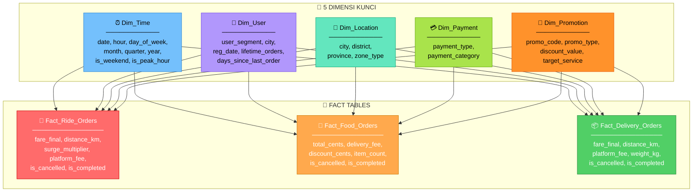
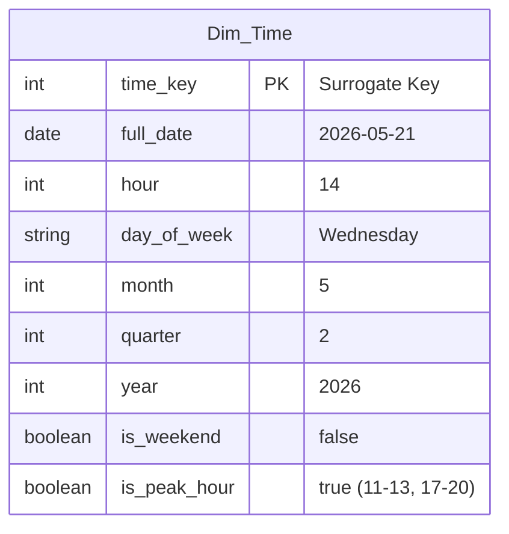
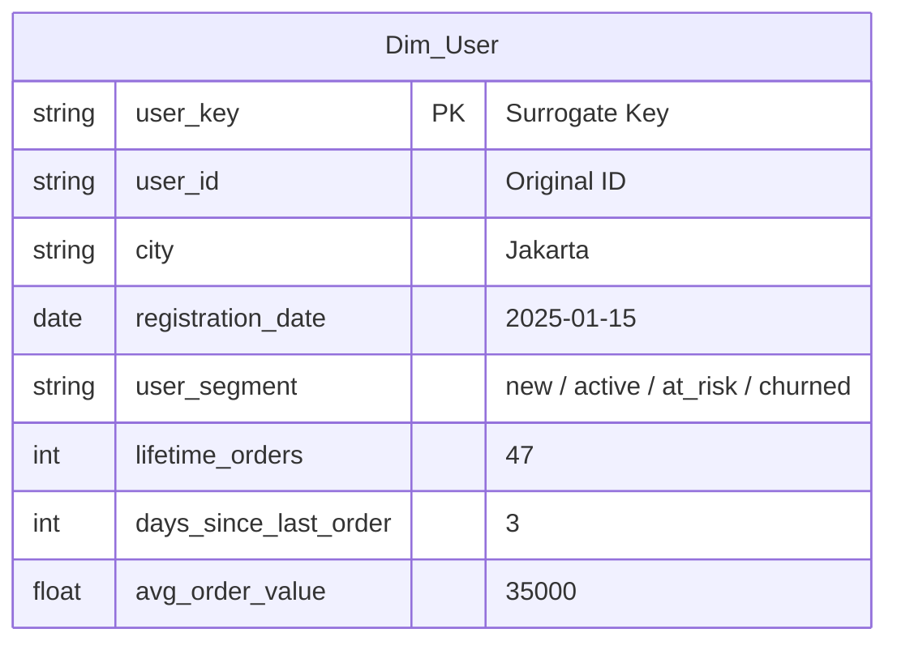
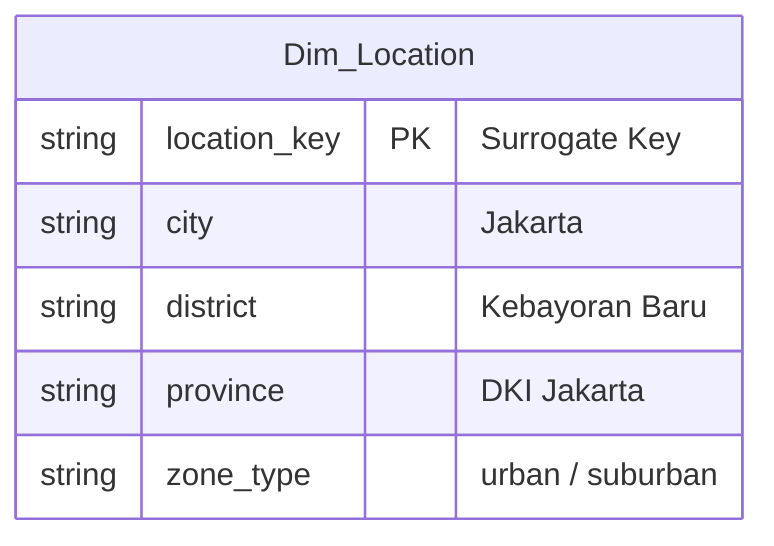
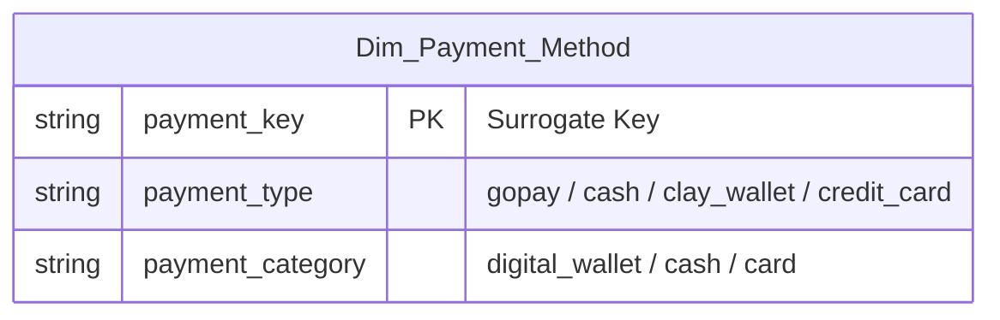
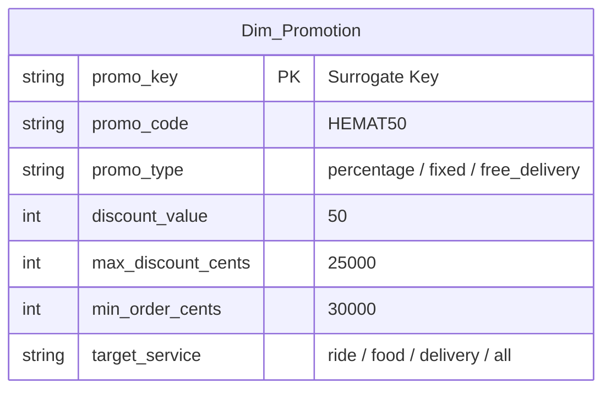
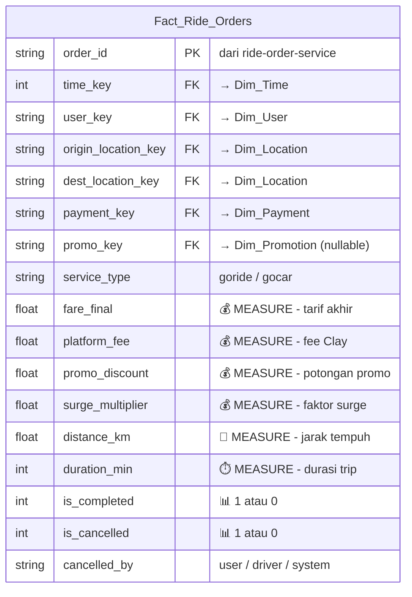
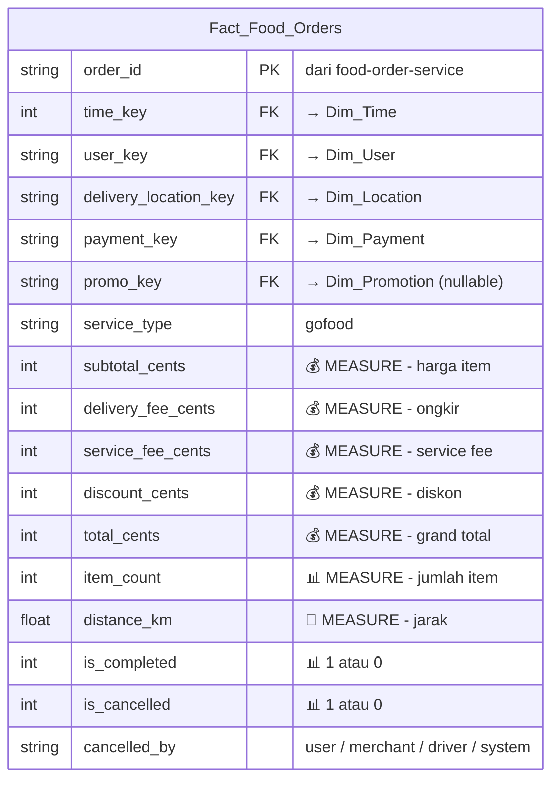
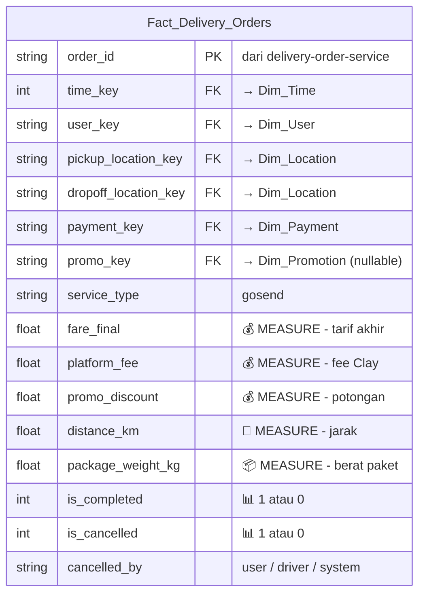
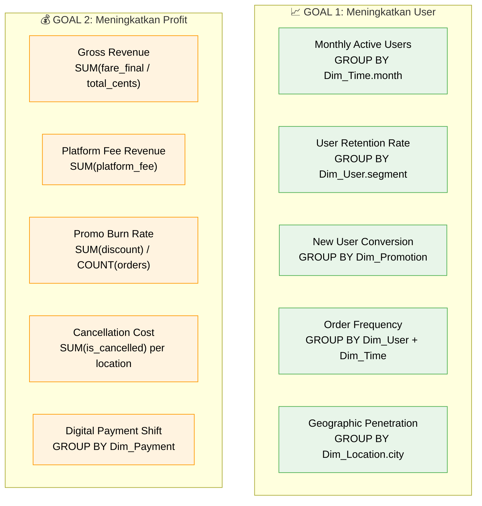

# Rancangan Data Warehouse Clay — Fokus Manager

> **Goal:** Sebagai Manager Clay, kita punya 2 tujuan utama:
> 1. 📈 **Meningkatkan penggunaan user** (user engagement & retention)
> 2. 💰 **Meningkatkan profit** (revenue naik, cost turun)

---

## Kenapa Cuma 5 Dimensi?

Dari 8 dimensi sebelumnya, kita **pilih 5 yang paling berdampak** langsung ke 2 goal di atas. Prinsipnya: **"Kalau dimensi ini gak bisa bantu jawab pertanyaan bisnis yang kritis, buang."**

| Dimensi | Keep? | Alasan |
|---|---|---|
| ⏰ Dim_Time | ✅ | Wajib — tanpa waktu gak bisa lihat tren |
| 👤 Dim_User | ✅ | Wajib — target utama kita adalah user |
| 📍 Dim_Location | ✅ | Penting — ekspansi & alokasi driver per wilayah |
| 💳 Dim_Payment_Method | ✅ | Penting — cash vs digital langsung affect profit margin |
| 🎫 Dim_Promotion | ✅ | Penting — promo itu cost besar, harus diukur ROI-nya |
| 🏍️ Dim_Driver | ❌ | Pindah ke measures — cukup hitung jumlah driver, gak perlu detail per driver |
| 🏪 Dim_Merchant | ❌ | Pindah ke measures — cukup di-aggregate, bukan fokus utama manager level atas |
| 🔧 Dim_Service_Type | ❌ | Dijadikan **atribut di Fact Table** aja (kolom `service_type`) — cuma 3 nilai |

---

## Diagram: Fact Constellation — Versi Fokus



---

## Detail: 5 Dimensi + Alasan Bisnis

### 1. ⏰ Dim_Time — "Kapan user paling aktif?"



| Goal | Pertanyaan yang bisa dijawab |
|---|---|
| 📈 User | "Jam berapa user paling banyak order? → push notif di jam itu" |
| 📈 User | "Hari apa order paling sepi? → kasih promo di hari itu" |
| 💰 Profit | "Kapan harus aktifkan surge pricing?" |
| 💰 Profit | "Quarter mana revenue paling tinggi? → forecast budget" |

### 2. 👤 Dim_User — "Siapa user kita dan gimana perilakunya?"



**Segmentasi user_segment:**

| Segment | Definisi | Aksi Manager |
|---|---|---|
| `new` | Register < 30 hari, order < 3x | Kasih voucher onboarding |
| `active` | Order ≥ 1x dalam 14 hari terakhir | Pertahankan, kasih loyalty reward |
| `at_risk` | Terakhir order 15-30 hari lalu | Kirim push notif + diskon win-back |
| `churned` | Tidak order > 30 hari | Kampanye re-engagement agresif |

| Goal | Pertanyaan yang bisa dijawab |
|---|---|
| 📈 User | "Berapa % user yang churned bulan ini?" |
| 📈 User | "Promo apa yang paling efektif untuk user at_risk?" |
| 💰 Profit | "User segment mana yang punya avg_order_value tertinggi?" |
| 💰 Profit | "Berapa cost akuisisi user baru vs retain user lama?" |

### 3. 📍 Dim_Location — "Di mana demand tinggi dan profit bagus?"



| Goal | Pertanyaan yang bisa dijawab |
|---|---|
| 📈 User | "Kota mana yang pertumbuhan user-nya paling cepat?" |
| 📈 User | "District mana yang underserved? → prioritas ekspansi" |
| 💰 Profit | "Kota mana yang cancellation rate-nya tinggi? → alokasi driver" |
| 💰 Profit | "Zona mana yang delivery cost-nya terlalu mahal?" |

### 4. 💳 Dim_Payment_Method — "Gimana cara user bayar?"



| Goal | Pertanyaan yang bisa dijawab |
|---|---|
| 📈 User | "Berapa % user masih pakai cash? → dorong migrasi ke digital" |
| 💰 Profit | "Digital payment → settlement lebih cepat, fraud lebih rendah" |
| 💰 Profit | "User yang pakai Clay Wallet → lebih loyal (uang sudah di-topup)" |
| 💰 Profit | "Cash order punya cancellation rate lebih tinggi? → validasi" |

**Kenapa ini penting untuk profit:**
- 💵 **Cash** = driver harus bawa uang kembalian, risiko fraud tinggi, settlement lambat
- 💳 **Digital** = settlement instan, fraud rendah, user cenderung order lebih besar

### 5. 🎫 Dim_Promotion — "Promo mana yang worth it?"



| Goal | Pertanyaan yang bisa dijawab |
|---|---|
| 📈 User | "Promo tipe apa yang paling banyak menarik user baru?" |
| 📈 User | "Free delivery vs percentage discount — mana yang lebih efektif?" |
| 💰 Profit | "Berapa ROI tiap promo? (revenue generated / discount given)" |
| 💰 Profit | "Ada gak promo yang burn rate-nya tinggi tapi gak nambah retention?" |

---

## Detail: Fact Tables + Measures

### Fact_Ride_Orders



### Fact_Food_Orders



### Fact_Delivery_Orders



---

## Contoh Analisis: Dashboard Manager

### 📊 KPI Utama yang Bisa Diukur



### Query: Retention Rate per User Segment per Bulan

```sql
SELECT
    du.user_segment,
    dt.month_name,
    dt.year,
    COUNT(DISTINCT du.user_key) AS total_users,
    COUNT(DISTINCT CASE WHEN fr.is_completed = 1 THEN du.user_key END) AS active_users,
    ROUND(
        COUNT(DISTINCT CASE WHEN fr.is_completed = 1 THEN du.user_key END) * 100.0
        / NULLIF(COUNT(DISTINCT du.user_key), 0), 2
    ) AS retention_rate_pct
FROM Fact_Ride_Orders fr
JOIN Dim_User du ON fr.user_key = du.user_key
JOIN Dim_Time dt ON fr.time_key = dt.time_key
GROUP BY du.user_segment, dt.month_name, dt.year
ORDER BY dt.year, dt.month_name, retention_rate_pct DESC;
```

### Query: Promo ROI — Mana yang Worth It?

```sql
SELECT
    dp.promo_code,
    dp.promo_type,
    COUNT(*) AS times_used,
    SUM(ff.discount_cents) / 100 AS total_discount_rp,
    SUM(ff.total_cents) / 100 AS total_revenue_rp,
    ROUND(SUM(ff.total_cents) * 1.0 / NULLIF(SUM(ff.discount_cents), 0), 2) AS roi,
    COUNT(DISTINCT ff.user_key) AS unique_users_reached
FROM Fact_Food_Orders ff
JOIN Dim_Promotion dp ON ff.promo_key = dp.promo_key
WHERE dp.promo_key IS NOT NULL
GROUP BY dp.promo_code, dp.promo_type
HAVING SUM(ff.discount_cents) > 0
ORDER BY roi DESC;
```

### Query: Cash vs Digital — Impact ke Cancellation

```sql
SELECT
    dpm.payment_type,
    dpm.payment_category,
    COUNT(*) AS total_orders,
    SUM(fr.is_cancelled) AS cancelled,
    ROUND(SUM(fr.is_cancelled) * 100.0 / COUNT(*), 2) AS cancel_rate_pct,
    AVG(fr.fare_final) AS avg_fare
FROM Fact_Ride_Orders fr
JOIN Dim_Payment_Method dpm ON fr.payment_key = dpm.payment_key
GROUP BY dpm.payment_type, dpm.payment_category
ORDER BY cancel_rate_pct DESC;
```

---

## Kesimpulan: 5 Dimensi = 5 Lever Bisnis

| # | Dimensi | Lever untuk User 📈 | Lever untuk Profit 💰 |
|---|---|---|---|
| 1 | **⏰ Time** | Timing push notif & promo | Surge pricing & demand forecast |
| 2 | **👤 User** | Segmentasi & retention campaign | Identifikasi high-value users |
| 3 | **📍 Location** | Ekspansi ke area underserved | Optimasi alokasi driver & biaya |
| 4 | **💳 Payment** | Dorong adopsi digital wallet | Kurangi fraud & percepat settlement |
| 5 | **🎫 Promotion** | Akuisisi & win-back user | Kontrol burn rate & ukur ROI |
